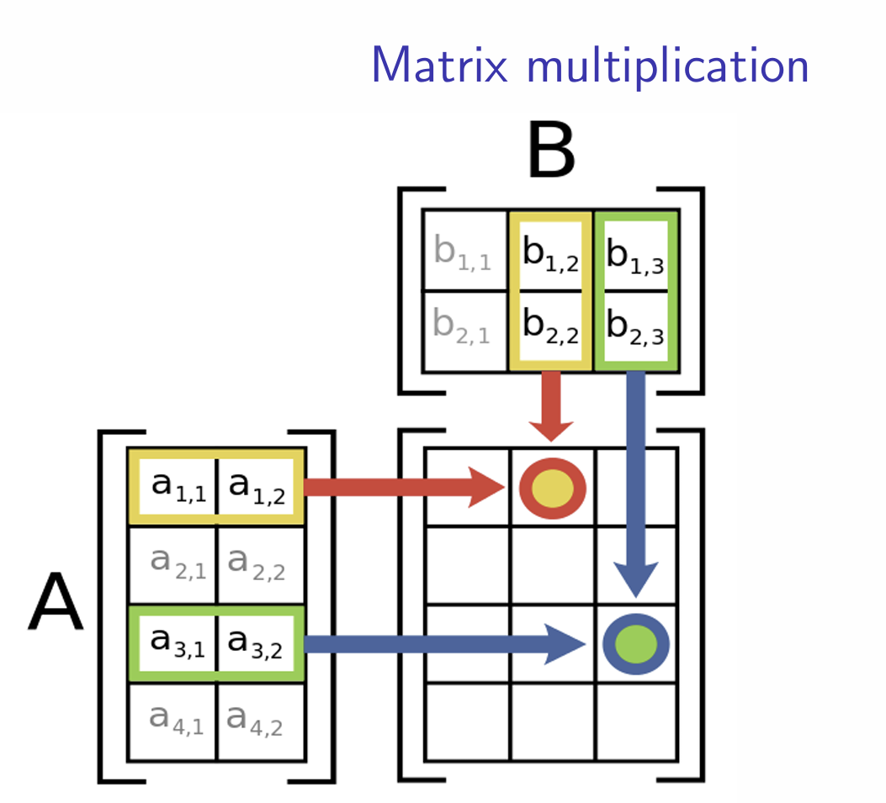

{fig-align="center" out-width="100%"}

------------------------------------------------------------------------

**12.1 SCALARS**

::: fragment
-   **Scalar** refers any single element of some set. For example, the number 3.5 is a scalar, as is any variable $x \in \mathbb{R}$.
:::

::: fragment
**12.2 VECTORS**
:::

::: fragment
-   One way of specifying a vector in this space is as an arrow from the origin (the zero) in three dimensions, $(0,0,0)$, to the point in question, such as from $(0,0,0)$ to $(3,1,2)$. The arrow points to $(3,1,2)$ in this case.
:::

------------------------------------------------------------------------

::: fragment
-   A vector will either be a lowercase letter in a bold font, such as $\mathbf{x}$ or $\mathbf{a}$, or a lowercase letter with an arrow over it, such as $\vec{x}$.
:::

::: fragment
-   Each **element**, or **component**, of the vector will be denoted by a subscript signifying its place in the vector. So, if $\mathbf{x} = (3,1,2)$, then $x_1 = 3$, $x_2 = 1$, and $x_3 = 2$. The **dimension** of a vector is the number of components in the vector.
:::

------------------------------------------------------------------------

### 12.2.1 Vector Length

::: fragment
-   The **length of a vector**, not to be confused with a vector's dimension, tells us how big it is. In one dimension this is straightforward: the scalar 5 has "length" 5.
:::

::: fragment
-   For any vector of dimension $n$, its length is given by $\|\mathbf{a}\| = \sqrt{a_1^2 + a_2^2 + \ldots + a_n^2}$. For example, the length of the vector $(2,4,4,1)$ is $\sqrt{2^2 + 4^2 + 4^2 + 1^2} = \sqrt{4 + 16 + 16 + 1} = \sqrt{37}$.
:::

::: fragment
Example: $$(5,-3,-6)+(1,8,7)=(6,5,1)$$
:::

::: fragment
$$
(5, 1, 4, 1) − (1, 2, 3, 4) = (4, −1, 1, −3)
$$
:::

------------------------------------------------------------------------

::: fragment
### 12.2.2 Vector Addition

-   Vectors add just like scalars (i.e., numbers). To add (or subtract) vectors, they must have the same dimension.
:::

::: fragment
-   The first component of the first vector adds to the first component of the second vector to form the first component of the added vector, and so on.
:::

::: fragment
-   $\mathbf{a} + \mathbf{b} = (a_1 + b_1, a_2 + b_2, \ldots, a_n + b_n)$ for two $n$-dimensional vectors. The same is true for subtraction, so that $\mathbf{a} - \mathbf{b} = (a_1 - b_1, a_2 - b_2, \ldots, a_n - b_n)$.
:::

------------------------------------------------------------------------

### 12.2.3 Scalar Multiplication

::: fragment
-   **Scalar multiplication** is multiplication of a vector by a scalar. To accomplish this, one needs to multiply each element in the vector by the scalar.
:::

::: fragment
-   So, in general, if $\mathbf{x}$ is an $n$-dimensional vector and $c$ is a scalar, then $c\mathbf{x} = (cx_1, cx_2, \ldots, cx_n)$.
:::

::: fragment
-   A more concrete example would be 5a, where a = (2, 1). The multiplied vector is (10, 5), where each of 2 and 1 have been multiplied by the scalar 5.
:::

::: fragment
-   Dividing by a scalar works the same as multiplying by one over that scalar (i.e., multiplying each element by $\frac{1}{c}$).
:::

------------------------------------------------------------------------

::: fragment
### 12.2.4 Vector Multiplication
:::

::: fragment
-   The **scalar product** is a way of multiplying vectors that results in a scalar.
:::

::: fragment
-   In general, if $\mathbf{a}$ and $\mathbf{b}$ are both $n$-dimensional vectors, then $\mathbf{a} \cdot \mathbf{b} = a_1b_1 + a_2b_2 + \ldots + a_nb_n$.
:::

::: fragment
-   Or, using summations, $\mathbf{a} \cdot \mathbf{b} = \sum_{i=1}^n a_ib_i$.
:::

::: fragment
Example: $$(3, 1) · (2, 3) = 6 + 3 = 9$$
:::

::: fragment
$$(6, 5, 4) · (9, 8, 7) = 54 + 40 + 28 = 122$$
:::

------------------------------------------------------------------------

## 12.3 MATRICES

::: fragment
-   A **matrix** is a rectangular table of numbers or variables that are arranged in a specific order in rows and columns.
:::

::: fragment
-   The size of a matrix in mathematics is known as its **dimensions** and is ex-pressed in terms of how many rows, $n$, and columns, $m$, it has, written as $n \times m$.
:::

::: fragment
-   A matrix $A_{n \times m}$ thus is a matrix with $n$ rows and $m$ columns.
:::

::: fragment
-   Matrix is a **column vector** if it has only one column but two or more rows, and a **row vector** if it has only one row but two or more columns.
:::

::: fragment
-   A **scalar** is a matrix with only one column and one row.
:::

------------------------------------------------------------------------

### 12.3.1 Some Special Types of Matrices

::: fragment
-   A **square matrix** is a matrix that has an equal number of columns and rows, i.e., $m = n$. For example,

$$
A_{3 \times 3} = \begin{pmatrix}
a_{11} & a_{12} & a_{13} \\
a_{21} & a_{22} & a_{23} \\
a_{31} & a_{32} & a_{33}
\end{pmatrix}.
$$
:::

::: fragment
-   A **zero matrix** is a square matrix in which all elements are 0.
:::

::: fragment
-   A **diagonal matrix** is a square matrix in which all elements other than those on the main diagonal are zero.
:::

::: fragment
-   An **identity matrix** is a diagonal matrix in which all elements on the main diagonal are 1.
:::

------------------------------------------------------------------------

::: fragment
-   A **lower triangular matrix** has non-zero elements only on or below the main diagonal, while an **upper triangular matrix** has non-zero elements only on or above the main diagonal. Examples of these are:

$$
L_{3 \times 3} = \begin{pmatrix}
a_{11} & 0 & 0 \\
a_{21} & a_{22} & 0 \\
a_{31} & a_{32} & a_{33}
\end{pmatrix}, \quad U_{3 \times 3} = \begin{pmatrix}
a_{11} & a_{12} & a_{13} \\
0 & a_{22} & a_{23} \\
0 & 0 & a_{33}
\end{pmatrix}.
$$
:::

::: fragment
-   A **symmetric matrix** is a square matrix in which the elements are symmetric about the main diagonal, or more formally one in which $a_{ij} = a_{ji}$. For example,

$$
A_{3 \times 3} = \begin{pmatrix}
a_{11} & a_{12} & a_{13} \\
a_{12} & a_{22} & a_{23} \\
a_{13} & a_{23} & a_{33}
\end{pmatrix}
$$
:::

::: fragment
-   An **idempotent matrix** $A$ is a matrix with the property $AA = A$. That is, when you multiply it by itself, it returns the original matrix.
:::

::: fragment
-   A **singular matrix** is one that has a determinant of 0, while a **nonsingular matrix** has a determinant that is not 0.
:::

------------------------------------------------------------------------

::: fragment
The **transpose** of a matrix is another matrix in which the rows and columns have been switched, i.e., the rows of the first matrix are written as columns in the second and the columns in the first matrix are written as rows in the second.
:::

::: fragment
-   The typical notation for the transpose of $A$ is either $A^T$ or $A'$.
:::

::: fragment
$$A = \begin{bmatrix} 
1 & 3 & 0 \\
-1 & 6 & 2
\end{bmatrix}$$
:::

::: fragment
$$A^T = \begin{bmatrix}
1 & -1 \\
3 & 6 \\
0 & 2
\end{bmatrix}$$
:::

------------------------------------------------------------------------

::: fragment
**Matrix Addition and Subtraction** - Given two matrices $A$ and $B$ of equal dimensions, the operation $A + B$ will result in a matrix $C$ with the same dimensions where each element $c_{i,j} = a_{i,j} + b_{i,j}$.
:::

::: fragment
$$\begin{bmatrix}
1 & -2 \\
0 & 5 \\
4 & 3
\end{bmatrix} + 
\begin{bmatrix}
3 & 9 \\
-1 & 1 \\
0 & 2
\end{bmatrix} =
\begin{bmatrix}
4 & 7 \\
-1 & 6 \\
4 & 5
\end{bmatrix}$$
:::

::: fragment
-   For subtraction, e.g., $A - B$, each element $c_{i,j}$ in $C$ will equal $a_{i,j} - b_{i,j}$.
:::

::: fragment
$$\begin{bmatrix}
1 & -2 \\
0 & 5 \\
4 & 3
\end{bmatrix} -
\begin{bmatrix}
3 & 9 \\
-1 & 1 \\
0 & 2
\end{bmatrix} =
\begin{bmatrix}
-2 & -11 \\
1 & 4 \\
4 & 1
\end{bmatrix}$$
:::

------------------------------------------------------------------------

#### 12.3.4.1 Scalar Multiplication

::: fragment
-   Multiply each individual element of the matrix by the scalar to find the product. Formally, $C = rA$, where each $c_{i,j} = r \times a_{i,j}$.

$$5 \times \begin{bmatrix} 
1 & -2 \\
0 & 5 \\
4 & 3
\end{bmatrix} = 
\begin{bmatrix}
5 & -10 \\
0 & 25 \\
20 & 15
\end{bmatrix}$$
:::

------------------------------------------------------------------------

::: fragment
#### 12.3.4.2 Matrix Multiplication

-   In order to be able to multiply two matrices, the number of columns in the first must match the number of rows in the second matrix, e.g., $A_{n \times m}$ and $B_{m \times p}$: $A_{n \times m}B_{m \times p} = C_{n \times p}$
:::

------------------------------------------------------------------------

{fig-align="center" out-width="100%"}

------------------------------------------------------------------------

Example:

::: fragment
$$AB = \begin{bmatrix}
1 & -2 \\
0 & 5 \\
4 & 3
\end{bmatrix} \times 
\begin{bmatrix}
3 & 1 & 4 \\
-1 & 2 & 5
\end{bmatrix}$$
:::

::: fragment
$$= \begin{bmatrix}
(1 \times 3) + (-2 \times -1) & (1 \times 1) + (-2 \times 2) & (1 \times 4) + (-2 \times 5) \\
(0 \times 3) + (5 \times -1) & (0 \times 1) + (5 \times 2) & (0 \times 4) + (5 \times 5) \\
(4 \times 3) + (3 \times -1) & (4 \times 1) + (3 \times 2) & (4 \times 4) + (3 \times 5)
\end{bmatrix}$$
:::

::: fragment
$$= \begin{bmatrix}
3 + 2 & 1 - 4 & 4 - 10 \\
0 - 5 & 0 + 10 & 0 + 25 \\
12 - 3 & 4 + 6 & 16 + 15
\end{bmatrix}$$
:::

::: fragment
$$= \begin{bmatrix}
5 & -3 & -6 \\
-5 & 10 & 25 \\
9 & 10 & 31
\end{bmatrix}$$
:::

------------------------------------------------------------------------

Example:

::: fragment
$$BA = \begin{bmatrix}
3 & 1 & 4 \\
-1 & 2 & 5
\end{bmatrix} \times
\begin{bmatrix}
1 & -2 \\
0 & 5 \\
4 & 3
\end{bmatrix}$$
:::

::: fragment
$$= \begin{bmatrix}
(3 \times 1) + (1 \times 0) + (4 \times 4) & (3 \times -2) + (1 \times 5) + (4 \times 3) \\
(-1 \times 1) + (2 \times 0) + (5 \times 4) & (-1 \times -2) + (2 \times 5) + (5 \times 3)
\end{bmatrix}$$
:::

::: fragment
$$= \begin{bmatrix}
3 + 0 + 16 & -6 + 5 + 12 \\
-1 + 0 + 20 & 2 + 10 + 15
\end{bmatrix}$$
:::

::: fragment
$$= \begin{bmatrix}
19 & 11 \\
19 & 27
\end{bmatrix}$$
:::

------------------------------------------------------------------------

### 12.3.5 Trace

::: fragment
-   The **trace** of an $n \times n$ square matrix is the sum of its diagonal elements. Formally, $\text{Tr}(A) = \sum_{i=1}^n a_{ii} = a_{11} + a_{22} + \ldots + a_{nn}$.
:::

::: fragment
### 12.3.6 Determinant

-   The **determinant** of a matrix is a commonly used function that converts the matrix into a scalar. $|A|$ is the determinant of matrix $A$.
:::

------------------------------------------------------------------------

::: fragment
Consider the two-by-two matrix,

$$A = \begin{bmatrix} 
a_{11} & a_{12} \\
a_{21} & a_{22}
\end{bmatrix}$$
:::

::: fragment
-   The determinant of $A$ is the difference of the diagonal products:

$$|A| = (a_{11} \cdot a_{22}) - (a_{12} \cdot a_{21})$$
:::

::: fragment
Consider the following three-by-three matrix:

$$B = \begin{bmatrix}
b_{11} & b_{12} & b_{13} \\
b_{21} & b_{22} & b_{23} \\
b_{31} & b_{32} & b_{33}
\end{bmatrix}$$
:::

::: fragment
-   Define the **minor** of element $b_{23}$ as the determinant of the submatrix of $b_{23}$. The minor of $b_{23}$ is:

$$M_{23} = \begin{bmatrix}
b_{11} & b_{12} \\
b_{31} & b_{32}
\end{bmatrix} = (b_{11} \cdot b_{32}) - (b_{31} \cdot b_{12})$$
:::

------------------------------------------------------------------------

#### 12.3.6.1 co-factor

::: fragment 
-   a co-factor is a minor with a prescribed sign which we will call $C_{ij}$ based on the combination of $i+j$ determines the sign specifically if $i+j$ is odd then we multiply the minor $M_{ij}$ we calculated by -1. 
:::

::: fragment 
-   if the combination is even then the sign of the co-factor $C_{ij}$ is whatever the sign of the minor $M_{ij}$ came out to be. 
:::

::: fragment
the alternative way to calculate the determinant of a 3x3 matrix is the Sarrus rule.(reference the board) 
:::

------------------------------------------------------------------------

#### 12.3.7 row operations. 

::: fragment
-   like we learned in algebra systems of equations we can use elimination to restructure matrices. the goal when doing this is to get a matrix into triangular form so we can solve the system of equations it represents.  
:::

::: fragment 
-   if we had a matrix equation that looked like this we can solve it by making the matrix triangular 
$$\begin{bmatrix}
1 & 2 \\
2 & 7 \\
\end{bmatrix} 
\times \begin{bmatrix}
x\\
y\\
\end{bmatrix}
=\begin{bmatrix}
4\\
5\\
\end{bmatrix}$$
:::

------------------------------------------------------------------------

**continued**

::: fragment 
-    first we simplify the notation
$$\begin{bmatrix}
1 & 2 &|4\\
2 & 7 &|5
\end{bmatrix}$$
:::

::: fragment
-   then we do a row operation by subtracting 2 times row 1 from row 2 to eliminate the 2 in position 3. 
$$\begin{bmatrix}
1 & 2 &|4\\
2-2 & 7-4 &|5-8
\end{bmatrix}
= \begin{bmatrix}
1 & 2 &|4\\
0 & 3 &|-3
\end{bmatrix}$$
:::

::: fragment 
-   we can divide row 2 by 3 to get a leading 1 in the row (this is called reduced row echelon form REF) and an answer for y 
$$\begin{bmatrix}
1 & 2 &|4\\
0 & 1 &|-1
\end{bmatrix}
\rightarrow y = -1$$
:::

::: fragment 
-   plugging y back into the first equation (back substitution) we can get an answer for x = 6 in this case. 
:::

------------------------------------------------------------------------

#### 12.3.8 singular matrix

::: fragement
-   a singular matrix is what happens when one or more of the vectors in the matrix are collinear or coplanar, so the matrix does not fully span all dimensions. 
:::

:::fragment 
-   we can determine this in two ways either we take the determinant and it is 0, or we do row operations and get a row of zeros. 
:::

::: fragment
-   for example:
$$\begin{bmatrix}
1 & 1 \\
2 & 2
\end{bmatrix}$$
:::

::: fragment
-   is this matrix singular?
$$\begin{bmatrix}
1 & 2 & 3\\
4 & 5 & 6\\
7 & 8 & 9\\
\end{bmatrix}$$
:::

------------------------------------------------------------------------

#### 12.3.8.1 null space

::: fragment
-   if we have a singular matrix we have something called a null space, or the set of vectors that when multiplied with the matrix yields 0. 
:::

::: fragment 
-   to calculate a null space we first do row operations to get the matrix into REF then we do more row operations but going the other direction to eliminate any numbers above any leading ones (RREF) and make a vector by taking the coefficient of anything above a zero after a leading one and make it negative and place a one for any vector of zeros.
:::

::: fragment 
-   looking at our example matrices
$$\begin{bmatrix}
1 & 1 \\
2 & 2
\end{bmatrix}
= 
\begin{bmatrix}
1 & 1 \\
0 & 0
\end{bmatrix}$$
:::

::: fragment 
-   so the null space of this matrix is given below where r is a scalar
$$r\begin{bmatrix}
-1\\
1
\end{bmatrix}$$
:::

::: fragment 
what this means is that any vector that looks like this when multiplied by the matrix above will yield 0
:::

::: fragment 
try 
$$\begin{bmatrix}
1 & 2 & 3\\
4 & 5 & 6\\
7 & 8 & 9\\
\end{bmatrix}$$
:::

------------------------------------------------------------------------

#### 12.3.8.2 eigenvalue and eigenvector 

::: fragment
-   matrices have a special value and vector inside of them called eigenvalues and eigenvectors. these are especially useful for data analysis when you have a very large matrix or want to simplify the matrix for example when doing PCA. 
:::

::: fragment 
-   mathematically, an eigenvector is a vector whose position on the graph does not change when multiplied by the matrix only stretches or shrinks by the associated eigenvalue. which means if you know the eigenvectors you can preserve the entire knowledge of a matrix. there is a special concept called SVD where you can retrieve the eigenvalues of a nonsquare matrix.  
::: 

::: fragment
to retrieve the eigenvalues $\lambda$ of matrix A we use this formula $Det(A-\lambda I)=0$, so we take the determinant of our matrix A minus the identity matrix times some unknown coefficient yielding a polynomial and solve for those coefficients.
:::

------------------------------------------------------------------------

**eigenvalues** 

::: fragment
-   lets take 
$$\begin{bmatrix}
2 & 1 \\
1 & 2 \\
\end{bmatrix}$$
:::

::: fragment 
-   we subtract the identity and out scalar
$$\begin{bmatrix}
2-\lambda & 1 \\
1 & 2-\lambda \\
\end{bmatrix}$$
:::

::: fragment 
-   we then take the determinant
$$ (2-\lambda)(2-\lambda)-1 = \lambda^2 -4\lambda+4-1 = \lambda^2-4\lambda - 3$$
:::

::: fragment
-    we can then factor our polynomial and get the eigenvalues 
$$(\lambda -1)(\lambda - 3), \lambda = 1,3$$
:::

------------------------------------------------------------------------

**eigenvectors**

::: fragment
-   for the vectors we plug the eigenvalues back into our $A-\lambda I$ and get the null space, we know there will be a null space since we solved determinant = 0 to get the values.
:::

::: fragment 
-   using our previous matrix and values we have 
$$\begin{bmatrix}
2-1 & 1 \\
1 & 2-1 \\
\end{bmatrix}
= \begin{bmatrix}
1 & 1 \\
1 & 1 \\
\end{bmatrix}$$
::: 

::: fragment 
- doing row operations to get a null space we get  
$$\begin{bmatrix}
1 & 1 \\
1 & 1 \\
\end{bmatrix} = 
\begin{bmatrix}
1 & 1 \\
0 & 0 \\
\end{bmatrix}\rightarrow 
\begin{bmatrix}
1 \\
-1 \\
\end{bmatrix}$$
:::

------------------------------------------------------------------------

::: fragment 
-   looking at our other value of 3
$$\begin{bmatrix}
2-3 & 1\\
1 & 2-3\\
\end{bmatrix}
= \begin{bmatrix}
-1 & 1\\
1 & -1\\
\end{bmatrix}$$
:::

::: fragment
$$\begin{bmatrix}
-1 & 1\\
1 & -1\\
\end{bmatrix} = 
\begin{bmatrix}
-1 & 1\\
0 & 0 \\
\end{bmatrix}\rightarrow 
\begin{bmatrix}
1 \\
1  \\
\end{bmatrix}$$
:::

------------------------------------------------------------------------

### 12.3.7 Inverse

::: fragment
-   An $n \times n$ matrix, $A$, is invertible (only square matrices can be inverted) if one can find a second $n \times n$ matrix, $B$, such that the product $AB$ and the product $BA$ both produce the $n \times n$ identity matrix, $I_{n \times n}$.
:::

::: fragment
-   In such a situation, $B$ is the inverse of $A$. The inverse of a square matrix is the matrix that produces the identity matrix when it is multiplied by it on either the left or the right:

$$A \cdot B = B \cdot A = I$$
:::

::: fragment
-   One denotes the inverse of a matrix by using a $-1$ superscript. So $A^{-1}$ is the inverse of $A$:

$$A \cdot A^{-1} = A^{-1} \cdot A = I$$
:::

::: fragment
-   This rule is a useful special case of the more general way to compute a matrix inverse, given by the following formula:

$$A^{-1} = \frac{1}{|A|}C^T$$
:::

------------------------------------------------------------------------

Example:

::: fragment
-   The transpose of this matrix, known as an **adjoint matrix**, then gets multiplied by $\frac{1}{|A|}$ to find $A^{-1}$.
:::

::: fragment
Let's try to find the inverse for the following matrix in this manner:
:::

::: fragment
$$A = \begin{bmatrix}
1 & 2 & 1 \\
0 & 4 & 3 \\
-6 & -2 & 2
\end{bmatrix}$$
:::

::: fragment
The determinant equals
:::

::: fragment
$$|A| = 1 \cdot M_{11} - 2 \cdot M_{12} + 1 \cdot M_{13} = 1(14) - 2(18) + 1(24) = 2$$
:::

::: fragment
Now we need to construct the cofactor matrix. Thus we first have to find all the minors:
:::

::: fragment
$$M_{11} = \begin{vmatrix}
4 & 3 \\
-2 & 2
\end{vmatrix} = (4 \cdot 2) - ((-2) \cdot 3) = 8 + 6 = 14$$
:::

::: fragment
$$M_{12} = \begin{vmatrix}
0 & 3 \\
-6 & 2
\end{vmatrix} = (0 \cdot 2) - ((-6) \cdot 3) = 0 + 18 = 18$$
:::

------------------------------------------------------------------------

::: fragment
... and so forth, until we find that all the minors are
:::

::: fragment
$$\begin{aligned}
M_{11} &= 14, \\
M_{12} &= 18, \\
M_{13} &= 24, \\
M_{21} &= 6, \\
M_{22} &= 8, \\
M_{23} &= 10, \\
M_{31} &= 2, \\
M_{32} &= 3, \\
M_{33} &= 4.
\end{aligned}$$
:::

::: fragment
With this information we can now construct our cofactor matrix (remember to multiply each minor by $(-1)^{i+j}$):
:::

::: fragment
$$C = \begin{bmatrix}
14 & -18 & 24 \\
-6 & 8 & -10 \\
2 & -3 & 4
\end{bmatrix}$$
:::

------------------------------------------------------------------------

::: fragment
Now we can transpose the cofactor matrix to find the adjoint matrix of $A$:
:::

::: fragment
$$\text{adj}(A) = \begin{bmatrix}
14 & -6 & 2 \\
-18 & 8 & -3 \\
24 & -10 & 4
\end{bmatrix}$$
:::

::: fragment
Finally, we multiply this matrix by $\frac{1}{|A|}$ to find the inverse of $A$:
:::

::: fragment
$$A^{-1} = \frac{1}{|A|}\text{adj}(A) = \frac{1}{2}\begin{bmatrix}
14 & -6 & 2 \\
-18 & 8 & -3 \\
24 & -10 & 4
\end{bmatrix} = \begin{bmatrix}
7 & -3 & 1 \\
-9 & 4 & -\frac{3}{2} \\
12 & -5 & 2
\end{bmatrix}$$
:::

::: fragment
Again, it's good to check to see whether $AA^{-1} = A^{-1}A = I$ (it does).
:::

------------------------------------------------------------------------

**Matrix and Vector Properties**:

::: fragment
|                                |                             |
|--------------------------------|-----------------------------|
| Associative property           | $(AB)C = A(BC)$             |
| Additive distributive property | $(A + B)C = AC + BC$        |
| Scalar commutative property    | $xAB = (xA)B = A(xB) = ABx$ |
:::

------------------------------------------------------------------------

## 12.4 PROPERTIES OF VECTORS AND MATRICES

::: fragment
-   $AB \neq BA$
:::

::: fragment
-   $IA = AI \quad$
:::

::: fragment
-   $\quad AA^{-1} = A^{-1}A$
:::

::: fragment
-   $a \cdot b = b \cdot a$
:::

::: fragment
-   $\text{tr}(A + B) = \text{tr}(A) + \text{tr}(B)$
:::

::: fragment
-   $\quad \text{tr}(A^T) = \text{tr}(A)$
:::

::: fragment
-   $\quad \text{tr}(AB) = \text{tr}(BA)$
:::

------------------------------------------------------------------------

**Matrix and Vector Transpose Properties**

::: fragment
|                         |                           |
|-------------------------|---------------------------|
| Inverse                 | $(A^T)^T = A$             |
| Additive property       | $(A + B)^T = A^T + B^T$   |
| Multiplicative property | $(AB)^T = B^T A^T$        |
| Scalar multiplication   | $(cA)^T = cA^T$           |
| Inverse transpose       | $(A^{-1})^T = (A^T)^{-1}$ |
| If A is symmetric       | $A^T = A$                 |
:::

::: fragment
**Matrix Determinant Properties**
:::

::: fragment
|                         |                                    |
|-------------------------|------------------------------------|
| Transpose property      | $\det(A) = \det(A^T)$              |
| Identity matrix         | $\det(I) = 1$                      |
| Multiplicative property | $\det(AB) = \det(A) \det(B)$       |
| Inverse property        | $\det(A^{-1}) = \frac{1}{\det(A)}$ |
:::

------------------------------------------------------------------------

**Matrix Inverse Properties**

::: fragment
|                               |                                          |
|-------------------------------|------------------------------------------|
| Inverse                       | $(A^{-1})^{-1} = A$                      |
| Multiplicative property       | $(AB)^{-1} = B^{-1}A^{-1}$               |
| Scalar multiplication (n x n) | $(cA)^{-1} = c^{-1}A^{-1}$ if $c \neq 0$ |
:::

------------------------------------------------------------------------

## 12.5 MATRIX ILLUSTRATION OF OLS ESTIMATION

::: fragment
-   Consider the OLS regression equation $\mathbf{y} = \alpha + \beta \mathbf{x} + \epsilon$, where $\mathbf{x}$ and $\mathbf{y}$ are vectors containing the values of the independent and dependent variables, respectively, for each observation;
:::

::: fragment
-   $\alpha$ is a scalar containing the $y$-intercept (i.e., the expected value of $y$ when $x = 0$);
:::

::: fragment
-   $\epsilon$ is a vector that holds the errors (i.e., the distance between the regression line and the value of $\mathbf{y}$);
:::

::: fragment
-   and $\beta$ is a scalar holding the value of average change in $\mathbf{y}$ given a one-unit increase in $\mathbf{x}$.
:::

::: fragment
-   We know the values of $\mathbf{x}$ and $\mathbf{y}$, and our problem is to "estimate" the values of $\alpha$ and $\beta$ that produce the regression line.
:::

------------------------------------------------------------------------

::: fragment
-   OLS regression proposes that the best fit is produced by selecting the values of $\alpha$ and $\beta$ that minimize the sum of squared errors $\left( \sum_i \epsilon_i^2 \right)$.
:::

::: fragment
-   You will likely learn that the OLS estimator is the best linear unbiased estimator (BLUE) in your statistics coursework, and we sketch a proof of this fact using matrix algebra in the next chapter.
:::

::: fragment
-   It turns out that we can calculate a vector that contains the values of $\alpha$ and $\beta$, call it $\hat{\beta}$, by using the equation:

$$\hat{\beta} = (X^TX)^{-1}X^T \mathbf{y}$$
:::

------------------------------------------------------------------------

Example:

::: fragment
-   Let's call $\mathbf{y}$ "size of government" and $\mathbf{x}$ "per capita income."

| State          | Per Capita Income | \% Gov't Employees |
|----------------|-------------------|--------------------|
| Alabama        | \$24,028          | 19.2               |
| Florida        | \$30,446          | 14.5               |
| Georgia        | \$29,442          | 16.4               |
| Mississippi    | \$23,448          | 21.8               |
| North Carolina | \$28,235          | 17.3               |
| South Carolina | \$26,132          | 18.2               |
| Tennessee      | \$28,455          | 15.5               |
:::

------------------------------------------------------------------------

::: fragment
-   This gives us the vector $\mathbf{y} ^T = (19.2, 14.5, 16.4, 21.8, 17.3, 18.2, 15.5)$.
:::

::: fragment
-   Because we are estimating both $\alpha$ and $\beta$, we need to add a column of 1s to the $\mathbf{x}$ vector, producing the matrix $X$.
:::

::: fragment
$$
X = \begin{bmatrix} 1 & 24,028 \\ 1 & 30,446 \\ 1 & 29,442 \\ 1 & 23,448 \\ 1 & 28,235 \\ 1 & 26,132 \\ 1 & 28,445 \end{bmatrix}
$$
:::

------------------------------------------------------------------------

::: fragment
-   We can now take the product of the matrices $X^T$ and $X$, yielding:
:::

::: fragment
$$
X^TX = \begin{bmatrix} 7 & 190,356 \\ 190,356 & 5,218,840,922 \end{bmatrix}
$$
:::

::: fragment
-   The next step is to calculate the inverse of that matrix:
:::

::: fragment
$$
(X^TX)^{-1} = \begin{bmatrix} 17.603 & -0.001 \\ -0.001 & 0.000 \end{bmatrix}
$$
:::

------------------------------------------------------------------------

::: fragment
-   Let's now calculate the product of $X^T$ and $\mathbf{y}$:
:::

::: fragment
$$
X^T \mathbf{y} = \begin{bmatrix} 1 & 24,028 \\ 1 & 30,446 \\ 1 & 29,442 \\ 1 & 23,448 \\ 1 & 28,235 \\ 1 & 26,132 \\ 1 & 28,445 \end{bmatrix} \begin{bmatrix} 19.2 \\ 14.5 \\ 16.4 \\ 21.8 \\ 17.3 \\ 18.2 \\ 15.5 \end{bmatrix} = \begin{bmatrix} 122.9 \\ 3,301,785.2 \end{bmatrix}
$$
:::

::: fragment
-   That completed, we are now ready to calculate the OLS estimates of $\alpha$ and $\beta$ given the data in Table 12.5 and the equation $\hat{\beta} = (X^TX)^{-1}X^T \mathbf{y}$:
:::

::: fragment
$$
\begin{bmatrix} \beta \\ \alpha \end{bmatrix} = \begin{bmatrix} 17.603 & -0.001 \\ -0.001 & 0.000 \end{bmatrix} \begin{bmatrix} 122.9 \\ 3,301,785.2 \end{bmatrix} = \begin{bmatrix} 50.228 \\ -0.079 \end{bmatrix}
$$
:::

::: fragment
-   We thus have an OLS estimate of 50.228 for $\beta$ and -0.079 for $\alpha$.
:::

------------------------------------------------------------------------

## Problems

### Problem 1

Given the matrices:

$$
A = \begin{bmatrix} 2 & 8 \\ 3 & 0 \\ 5 & 1 \end{bmatrix}, \quad B = \begin{bmatrix} 2 & 0 \\ 3 & 8 \end{bmatrix}
$$

-   **Is** $AB$ defined?
-   **Calculate** $AB$.
-   **Can you calculate** $BA$? Why or why not?

------------------------------------------------------------------------

### Problem 2

Find the inverse of the matrix $B = \begin{bmatrix} 4 & 1 & -1 \\ 0 & 3 & 2 \\ 3 & 0 & 7 \end{bmatrix}$.

------------------------------------------------------------------------

**Any Questions?**

[Home](index.html)
